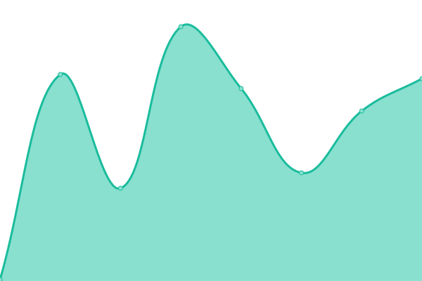
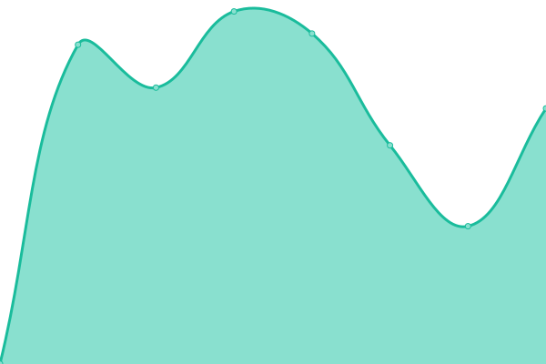

# [📈 Live Status](https://status.echousing.org): <!--live status--> **🟩 All systems operational**

This repository contains the open-source uptime monitor and status page for [echousing](https://status.echousing.org), powered by [Upptime](https://github.com/upptime/upptime).

With [Upptime](https://upptime.js.org), you can get your own unlimited and free uptime monitor and status page, powered entirely by a GitHub repository. We use [Issues](https://github.com/echousing/status/issues) as incident reports, [Actions](https://github.com/echousing/status/actions) as uptime monitors, and [Pages](https://status.echousing.org) for the status page.

<!--start: status pages-->
<!-- This summary is generated by Upptime (https://github.com/upptime/upptime) -->
<!-- Do not edit this manually, your changes will be overwritten -->
<!-- prettier-ignore -->
| URL | Status | History | Response Time | Uptime |
| --- | ------ | ------- | ------------- | ------ |
|  [SC HMIS](https://sp5.servicept.com/sc211/com.bowmansystems.sp5.core.ServicePoint/index.html) | 🟩 Up | [sc-hmis.yml](https://github.com/echousing/status/commits/HEAD/history/sc-hmis.yml) | 

 334ms
     
 | 

<a href="https://status.echousing.org/history/sc-hmis">100.00%</a>
    

|  [SC HMIS Training](https://sp5.servicept.com/sc211/com.bowmansystems.sp5.core.ServicePoint/index.html) | 🟩 Up | [sc-hmis-training.yml](https://github.com/echousing/status/commits/HEAD/history/sc-hmis-training.yml) | 

 52ms
     
 | 

<a href="https://status.echousing.org/history/sc-hmis-training">100.00%</a>
    

|  [ECHO Site](https://echousing.org) | 🟩 Up | [echo-site.yml](https://github.com/echousing/status/commits/HEAD/history/echo-site.yml) | 

 632ms
     
 | 

<a href="https://status.echousing.org/history/echo-site">100.00%</a>
    

|  [Tech Support Help Desk](https://support.echousing.org) | 🟩 Up | [tech-support-help-desk.yml](https://github.com/echousing/status/commits/HEAD/history/tech-support-help-desk.yml) | 

 312ms
     
 | 

<a href="https://status.echousing.org/history/tech-support-help-desk">100.00%</a>
    

|  [Maintenance Help Desk](https://maint.echousing.org) | 🟩 Up | [maintenance-help-desk.yml](https://github.com/echousing/status/commits/HEAD/history/maintenance-help-desk.yml) | 

 257ms
     
 | 

<a href="https://status.echousing.org/history/maintenance-help-desk">100.00%</a>
    

|  [Learn HMIS](https://learnhmis.echousing.org) | 🟩 Up | [learn-hmis.yml](https://github.com/echousing/status/commits/HEAD/history/learn-hmis.yml) | 

 602ms
     
 | 

<a href="https://status.echousing.org/history/learn-hmis">100.00%</a>
    

|  [E-Sign](https://esign.echousing.org) | 🟩 Up | [e-sign.yml](https://github.com/echousing/status/commits/HEAD/history/e-sign.yml) | 

 1034ms
     
 | 

<a href="https://status.echousing.org/history/e-sign">100.00%</a>
    

<!--end: status pages-->

[**Visit our status website →**](https://status.echousing.org)

## 📄 License

- Powered by: [Upptime](https://github.com/upptime/upptime)
- Code: [MIT](./LICENSE) © [echousing](https://status.echousing.org)
- Data in the `./history` directory: [Open Database License](https://opendatacommons.org/licenses/odbl/1-0/)
